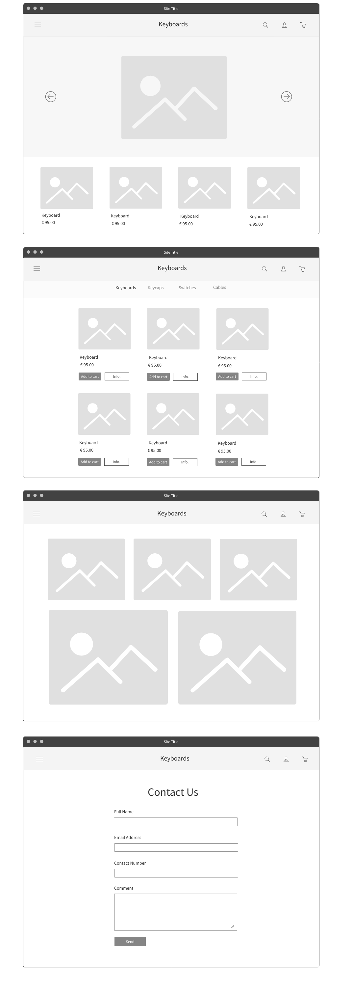

# Website Design Home Assignment

This project required us to create a website about a fictional company that offers any items or services using HTML, CSS, and JavaScript.

It needed to include four pages: home, products/services, gallery, and contact information.

[View via GitHub](https://emuel-vassallo.github.io/keyboards-shop-website/)

## Description of the Company

This is a store that offers mechanical keyboards, as well as a variety of related parts and products such as switches, mousepads, and coiled cables. Its main target audience consists of keyboard hobbyists and enthusiasts, programmers, and gamers. This company's goal is to make it easier for everyone looking to buy high-quality keyboard items online.

## Wireframes

