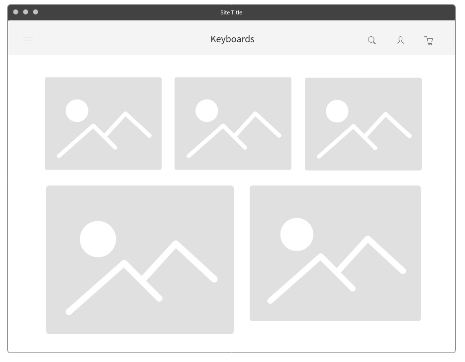

# Website Design Home Assignment

## Description

This assignment required us to create a website about a fictional company that offers any products or services using HTML, CSS, JavaScript, and jQuery.

It had to include four pages: home, products/services, gallery, and contact.

## Live Demo

**Preview**: [here](https://emuel-vassallo.github.io/keyboards-shop-website/)

## Proposal

### Description of the Company

This is a store that offers mechanical keyboards, as well as a variety of related parts and products such as switches, mousepads, and coiled cables. Its main target audience consists of keyboard hobbyists and enthusiasts, programmers, and gamers. This company's goal is to make it easier for everyone looking to buy high-quality keyboard items online.

### Wireframes

|              Home               |             Products             |
| :-----------------------------: | :------------------------------: |
|     |  |
|             Gallery             |             Contact              |
|  |   |

## Technologies

- HTML
- CSS
- JavaScript
- jQuery

## What I Learned

- Using jQuery plugins to create different kinds of galleries.
- Creating a sliding toggle menu with jQuery.
- Force an item to stay centered, despite each of it's children having different width.
- Changing the styling for a link in a navigation bar relating to the current page.
